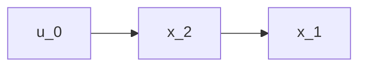
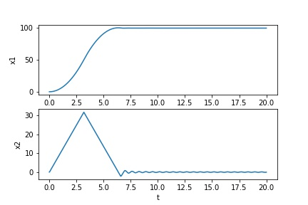
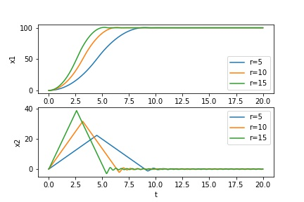
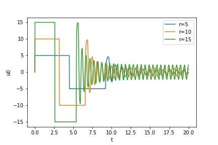

# 离散系统自抗扰控制ADRC入门

笔者从事航空航天器（模拟）控制系统开发已经一年多了，这一年从PID到ADRC，从单环到串级，也走了不少弯路。到今天，我们团队使用的PID控制器已经升级成了ADRCxPID的结合体，飞行器控制效果有了明显改善。这要归功于笔者在前段时间发现的新算法自抗扰控制(Adaptive Disturbence Rejection Control，ADRC)。

ADRC也不算是新算法了，控制界的朋友们应该都有所耳闻。自从韩老师在千禧年之初提出比PID更优的通用控制结构ADRC以来，这个算法就饱受争议，但在一些领域确实获得了很好的效果（至少在笔者开发的系统中是这样）。撰写此文是为了让自己对该算法有更好的理解，也能让刚入门的朋友们管中窥豹一番。

<!-- TOC -->

- [离散系统自抗扰控制ADRC入门](#离散系统自抗扰控制adrc入门)
  - [引言-为什么要用ADRC](#引言-为什么要用adrc)
  - [ADRC的核心要素](#adrc的核心要素)
  - [如何控制一个理想的二阶系统](#如何控制一个理想的二阶系统)

<!-- /TOC -->

## 引言-为什么要用ADRC

PID，这种被做飞控/无人机的朋友们津津乐道的算法，已经诞生了快一百年了。对于小型固定翼飞行器/航模/无人机而言，在模型参数并不明确的情况下，使用PID是绝佳的选择。但对于真正的战斗机/民航飞行器这种大型固定翼飞机而言，PID的一组参数只保证在某个速度和高度区间内的可靠控制，因此，工程人员需要使用增益调度（Gain Scheduling）的方法，在不同速度、高度或者大气密度的情况下调节PID的参数，获得多组参数集合。

> 为什么会这样：不同高度和速度决定了飞机各操纵面不同的气动效率，即模型改变了。这时如果依然使用原有的PID参数，可能会导致闭环系统从稳定变成不稳定，原有控制器失效。因此需要新的PID参数。

若模型参数精确已知，可用的方法就更多了：（非线性）动态逆、最优控制（LQR，LQG）、模型预测控制等。只可惜，这种情况并不多。获取飞行器的精确模型，需要大量的风洞试验和参数辨识技术，要投入大量的时间和人力成本。即便如此，”精确“的数学模型只能停留在理论层面，控制器设计所使用的模型也可能被简化或降阶，可以想象难度之大（至少对笔者而言，这些条件都不具备）。

自抗扰控制算法，克服了以上缺点。

首先，ADRC不需要模型的精确数据，而仅仅需要输入输出的定性关系和阶次关系，这在固定翼飞机上是完全满足的：升降舵控制纵向角速度，副翼控制滚转角速度。两者仅有轻微的耦合。油门直接控制前飞速度。姿态和舵面控制满足二阶系统特征。

其次，ADRC具有”模型在线辨识“功能，这是相比PID的优势所在。在不同的高度和速度下，ADRC对模型参数的容忍度大于PID，这要归功于扩张状态观测器的作用（ESO，一个神奇的设计）。这意味着我们不需要进行增益调度设计（或者很少的增益调度），省去了大量的设计时间。

最后，相比于PID只能控制线性/单输入单输出的系统，ADRC对各通道耦合度和非线性容忍度大大提升，这点是PID永远无法具备的（除非增益调度）。

总结成表，对比PID以及其他非线性控制算法和ADRC的优劣，可以看到ADRC具有更好的综合性能，尤其适合在无模型情境下的控制。

|                         | PID          | LQR（线性二次最优） | MPC（模型预测控制） | NLDI（非线性动态逆） | SM（滑模控制） | ADRC |
|-------------------------|--------------|---------------------|---------------------|----------------------|----------------|------|
| 无需数学模型            | √           | o                   | o                   | o                    | o              | √   |
| 可适用于非线性系统      | o            | o                   | √                  | √                   | √             | √   |
| 鲁棒性/抗扰动           | √           | √√                | √√                | o                    | √√           | √   |
| 稳定性                  | √           | √                  | √                  | √                   | √             | √   |
| 参数自适应/对环境的适应 | o            | o                   | o                   | o                    | o              | √√ |
| 准确性                  | √           | 可控                | 可控                | √√                 | √√           | √   |
| 快速性                  | 与稳定性矛盾 | 可控                | 可控                | √√                 | √√           | √√ |
| 算法实现难度            | √           | √√                | √√                | √√                 | √√√         | √√ |

## ADRC的核心要素
说到ADRC，若不提及TD（跟踪微分器），ESO（扩张观测器）和非线性反馈控制似乎有点说不过去。但笔者在实际使用时发现，ADRC的精髓并不在于同时使用这三个模块，而是对系统未知项的估计以及及时反馈。

## 如何控制一个理想的二阶系统
生活的很多系统都是二阶系统，如控制量直接控制加速度，间接实现位置的控制等。再如，一个理想的线性系统：

$$
\ddot x = u_0
$$

这里 $x$ 可以代表位置量，如汽车的位置，滑块的位置，飞机的姿态角等，此时 $\ddot x$ 就是加速度量。该公式表明，我们的操纵/控制输入 $u_0$  和系统的加速度成正比关系。

用更加一般的写法，把系统写为如下形式：

$$
\begin{cases}
    x = x_1 \\
    \dot x_1 = x_2 \\ 
    \dot x_2 = u_0 \\
    -r \leq u_0 \leq r (r>0)
\end{cases}
\tag{1} $$

这是二阶的串级系统，所谓串级，即控制输入 $u_0$ 直接驱动 $x_2$, $x_2$ 变化驱动 $x_1$, $u_0$ 和 $x_1$ 是间接驱动的关系。

现在，我们的任务是想让该系统镇定在 $x = x_d$ 位置。我们可以把它想象成，将一辆在起跑线静止的汽车，开到 $x_d$ 的终点位置并同时停下来。这期间必然要先踩油门加速（增加 $u_0$），但为了能使汽车在终点停下来，要在中途就开始踩刹车（减小 $u_0$），最后把汽车精准地停在终点线。

我们记误差 $e_1 = x_1 - x_d, e_2 = x_2$, 可以得到系统 $(1)$ 的误差系统：
$$
\begin{cases}
    e_1 = x_1 - x_d\\
    \dot e_1 = e_2 \\ 
    \dot e_2 = u_0 \\
    -r \leq u_0 \leq r (r>0)
\end{cases}
\tag{1 bis} $$

在 $u_0$ 有界的情况下，传统的Bang-Bang控制可以视为该系统的最速控制函数（最快时间镇定），控制率为如下形式：

$$
u_0 = -rsat(e_1 + \frac{e_2 |e_2|}{2r}, \delta)，\\
sat(e,\delta)= 
\begin{cases}
    sign(e), &|e| > \delta \\
    e/\delta , &|e| \leq \delta
\end{cases}
\tag{2}
$$

> 使用 $sat$ 函数可以避免控制器震颤。

我们尝试使用这个控制器控制系统 $(1)$ ！设置系统参数为如下：假设起点位置为0，终点位置 $x_d = 100$ ，汽车最大加速度和刹车为 $r = 10$。最后的仿真结果如图所示：

让我们看看改变 $r$ 的数值会发生什么：

